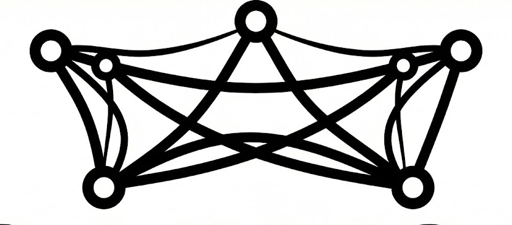
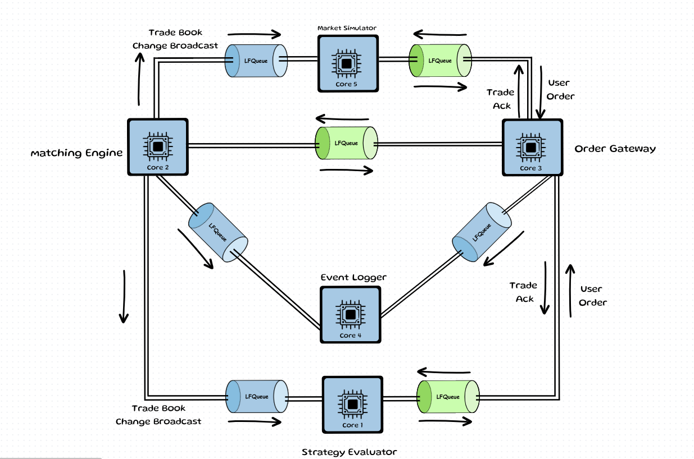

# CAPITOL : Trade Matching Engine In C++.



Capitol is a high-performance, multi-core trade matching engine designed to replicate the core logic and architecture of a modern electronic stock exchange. 
At its core, Capitol is a pipelined system that processes incoming buy and sell orders with sub-microsecond latency.

By pinning specific trading tasks to isolated CPU cores, the system eliminates the jitter caused by the Operating System, allowing it to handle bursts of millions of orders per second.

## High Level Architecture

The system is physically divided across 5 dedicated CPU cores to ensure one component never slows down another:



 ### 1. Order Gateway

Acts as the ingress point, it maps external 64-bit External Order IDs to internal 32-bit System ID using a SIMD-accelerated B+Tree based in memory key value store.

 ### 2. Matching Engine
The core processing unit that maintains the Price/Time Priority Limit Order Book (LOB) and executes aggressive matching, enforces Self-Trade Prevention (STP) to eliminate wash trading and generates incremental market data updates for every successful execution or book modification, and broadcasts them to arket maker and Alpha/Strategy Server.

 ### 3. Market Simulator
A high-fidelity traffic generator that reproduces real-world market dynamics by injecting diverse order types, cancellations, and updates into the engine to stress-test the user strategy.

 ### 4. MPSC Logger
A dedicated Memory core utilizing a Multiple-Producer Single-Consumer architecture with Round-Robin scheduling to aggregate telemetry from all trading cores. It persists up to 1.5M events/sec by offloading heavy formatting and I/O tasks to a background thread, preventing logging-induced jitter on the critical trading path.

 ### 5. Alpha/Strategy Server
The "Traders" layer that executes automated strategies based on live incremental broadcasts, simulating a competitive market participant's response to price movements.


## Trade Life Cycle
	


#### 1. Intake and Routing (Order Gateway)

The process begins when a participant—either a fast-acting strategy or a liquidity provider—submits a request. The **Order Gateway** acts as the primary coordinator and dispatcher. It identifies the participant and performs the necessary internal translations to make the request compatible with the engine's high-speed logic. Beyond intake, it is responsible for the vital routing of information; it ensures that once a trade is processed, the resulting confirmation is sent specifically back to the correct originator.

#### 2. The Handshake (Communication Layer)

Before reaching the matching logic, the request passes through a specialized communication path. This layer ensures that the information is handed off from the gateway to the engine without any stalls. It maintains a perfectly synchronized, one-way stream of data, allowing the gateway to continue accepting new orders while the engine is busy processing the current one.

#### 3. Execution and Book Management (Matching Engine)

The Matching Engine is where the actual trading logic resides. Its responsibility follows a specific sequence:

* Validation: It first checks the request against safety rules, such as ensuring a participant isn't accidentally trading with themselves.
* Aggressive Matching: It immediately compares the incoming request against existing orders in the book. If the prices overlap, it executes as many trades as possible.
* Aknowledgment & Incremental Update: As soon as a match occurs (or if a match is impossible), the engine generates two distinct signals. One signal is a private notification for the participant, and the second is a public "incremental change" signal to inform the rest of the market that the book has changed.
* Passive Placement: If the request is not fully filled by the aggressive check, the engine places the remaining portion into the order book, where it sits as a "passive" order waiting for a future match.

#### 4. Market Awareness (Trade Book Change Broadcast)

While the private confirmation is routed back to the user, the public incremental change signal is broadcasted to Market Maker and Alpha Server. This for updating the "state of the order book" for all participants. By sending out these updates, it allows everyone in the market to see the new price levels and available volume, triggering the next wave of trading activity.

#### 5. Audit and History (Logger)

In parallel with the execution and broadcasting, every single event—the intake, the match, the cancellation, and the broadcast—is funneled to the Logger. This component ensures that the exchange has a perfect, chronological record of every action. Its role is to capture this massive stream of information and store it reliably without ever slowing down the active trading occurring in the engine.


benchmarks :

```
================ BENCHMARK FOR : Tick To Trade Time ================


 p50 : 1075 cycles  (430 ns)
 p75 : 1146 cycles  (459 ns)
 p90 : 1256 cycles  (503 ns)
 p99 : 3866 cycles  (1548 ns)

====================================================================


================ BENCHMARK FOR : Matching Engine Processing Time ================


 p50 : 185 cycles  (74 ns)
 p75 : 232 cycles  (92 ns)
 p90 : 299 cycles  (119 ns)
 p99 : 579 cycles  (231 ns)

====================================================================


================ BENCHMARK FOR : Queue Wait Time ================


 p50 : 264 cycles  (105 ns)
 p75 : 274 cycles  (109 ns)
 p90 : 350 cycles  (140 ns)
 p99 : 2391 cycles  (957 ns)

====================================================================


================ BENCHMARK FOR : ME Throughput (time between consecutive reads) ================


 p50 : 1206 cycles  (483 ns)
 p75 : 1275 cycles  (510 ns)
 p90 : 1341 cycles  (537 ns)
 p99 : 3140 cycles  (1258 ns)

====================================================================


================ BENCHMARK FOR : Order Gateway Processing Time ================


 p50 : 286 cycles  (114 ns)
 p75 : 318 cycles  (127 ns)
 p90 : 343 cycles  (137 ns)
 p99 : 437 cycles  (175 ns)

====================================================================

```

Orders Processed Per Second ~ 2.3 Million orders/S at p50, 2 Million orders/S at p90.